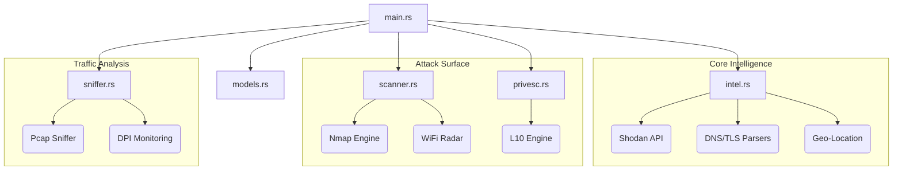

<p align="center">
  
</p>

<p align="center">
  
  
  
  
</p>

---

# 🛡️ NetVanguard v1.0.1
### *Hybrid Intelligence & Attack Surface Analyzer*

**NetVanguard**, modern siber güvenlik ihtiyaçları için geliştirilmiş, yüksek performanslı bir **Hibrit İstihbarat ve Saldırı Yüzeyi Analizörüdür**. Sadece bir ağ tarayıcısı değil, aynı zamanda pasif istihbarat (OSINT), aktif trafik analizi (Sniffing) ve yetki yükseltme (PrivEsc) vektörlerini tek bir çatı altında toplayan endüstriyel bir güvenlik paketidir.

> [!IMPORTANT]
> **NetVanguard**, Rust (Axum) tabanlı milisaniyelik tepki süresine sahip bir arka uç ve Vite + Neon-Glassmorphism estetiğiyle donatılmış profesyonel bir ön uç ile güçlendirilmiştir.

---

## 🚀 Ana Modüller

| Modül | Açıklama | Teknoloji |
| :--- | :--- | :--- |
| **🔍 Sniffer (DPI)** | TLS SNI analizi ve paket koklama ile gerçek zamanlı trafik izleme. | `libpcap`, `Axum` |
| **🌐 Global OSINT** | Shodan API entegrasyonu ile hedef IP'lerin dünya çapındaki sabıka kaydı ve coğrafi konumu. | `Shodan`, `Reqwest` |
| **🛡️ #L10 Analizörü** | SUID dosyaları ve Kernel bazlı yetki yükseltme açıklarını tespit eden tarama motoru. | `Linux Kernel API` |
| **📡 Network Radar** | Çevredeki Wi-Fi ağlarını ve aktif servisleri milisaniyeler içinde haritalandırır. | `Nmap`, `nmcli` |
| **📑 Smart Reporting** | Tüm bulguları profesyonel formatta dışa aktarabilen raporlama sistemi. | `Standard I/O` |

---

## 📸 Demo

*Not: Demo GIF placeholder'ıdır. Gerçek kullanım videoları için dokümantasyonu inceleyin.*

---

## 🏛️ Mimari Yapı (Modular Refactor)

Proje, sürdürülebilirlik ve performans için endüstriyel standartlarda modülerleştirilmiştir:



---

## 🛠️ Kurulum (Installation)

### Prerequisites (Gereksinimler)
- **Rust Compiler** (Cargo)
- **Nmap** (Network Mapping)
- **libpcap-dev** (Traffic Sniffing)
- **libssl-dev** (Secure Connections)

### Hızlı Başlatma
Projenizi saniyeler içinde ayağa kaldırmak için:

```bash
# Bağımlılıkları kur ve ortamı hazırla
chmod +x setup.sh
./setup.sh

# Uygulamayı yönetici yetkileriyle çalıştır (Sniffer için gereklidir)
sudo cargo run
```

---

## ⚖️ Yasal Uyarı (Legal Disclaimer)

> [!CAUTION]
> **DİKKAT:** NetVanguard, yalnızca **eğitim**, **etik sızma testi** ve **yetkili güvenlik analizleri** amaçlı geliştirilmiştir. Bu aracın yetkisiz sistemlerde kullanılması yasal sonuçlar doğurabilir. Kullanıcı, aracın kullanımından doğacak her türlü hukuki sorumluluğu kabul eder.

---

<p align="center">
  Developed with ❤️ by <b>Baha Furkan Yıldız</b> | NetVanguard Team v1.0.1
</p>
