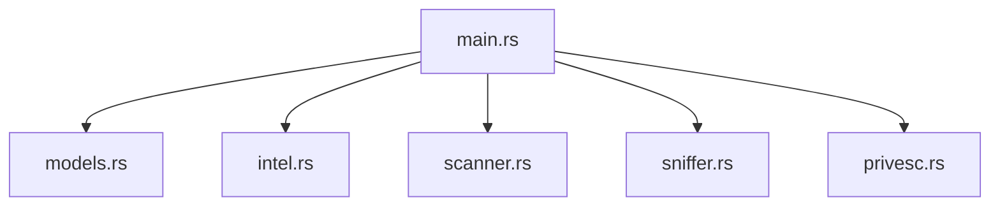

<p align="center">
  <a href="#-türkçe-versiyon">
    
  </a>
  <a href="#-english-version">
    
  </a>
</p>

# 🛡️ NetVanguard v1.0.1
### *Hybrid Intelligence & Attack Surface Analyzer*

<p align="center">
  
  
  
  
</p>

---

## 🇹🇷 Türkçe Versiyon

**NetVanguard**, modern siber güvenlik ihtiyaçları için geliştirilmiş, yüksek performanslı bir **Hibrit İstihbarat ve Saldırı Yüzeyi Analizörüdür**. Sadece bir ağ tarayıcısı değil, aynı zamanda pasif istihbarat (OSINT), aktif trafik analizi (Sniffing) ve yetki yükseltme (PrivEsc) vektörlerini tek bir çatı altında toplayan endüstriyel bir güvenlik paketidir.

### 🚀 Ana Modüller ve Kabiliyetler

#### 1. 🔍 Gelişmiş Ağ Tarama (Nmap Engine)
- **Hız Seçenekleri (Timing):** Gizlilik odaklı `T0` modundan, agresif `T5` moduna kadar tam kontrol.
- **Servis & Versiyon Tespiti:** Açık portların arkasındaki servislerin gerçek sürümlerini tespit eder.
- **İşletim Sistemi Analizi:** Hedef cihazın OS parmak izini çıkarır.
- **Vulnerability Taraması:** NSE kullanarak bilinen açıkları otomatik tarar.

#### 2. 🌐 Global Intelligence (OSINT & Geo)
- **Shodan Entegrasyonu:** Hedef IP'nin internet geçmişi ve bilinen zaafları (CVE).
- **Coğrafi Konum:** IP tabanlı konum tespiti (Şehir, ISP, ASN).
- **DNS & TLS Analizi:** Pasif DNS sorguları ve HTTPS sertifikalarından SNI ayrıştırma.

#### 3. 📂 Metadata & Sızıntı Analizi
- **Metadata (EXIF) Analizörü:** Görsel ve dökümanlardaki gizli meta verileri (GPS, cihaz bilgisi) ortaya çıkarır.
- **Sızıntı Tespiti (Breach Detection):** *XposedOrNot* API ile e-posta sızıntı kontrolü.

#### 4. ⚔️ #L10 Yetki Yükseltme Analizörü (PrivEsc)
- **SUID/GUID Kontrolü:** Yanlış yapılandırılmış kritik sistem dosyalarını tespit eder.
- **Kernel Exploit Suggester:** Çekirdek sürümüne göre potansiyel exploitleri raporlar.

#### 5. 📡 Network Radar & Sniffer
- **Real-Time Sniffer:** L2/L3 seviyesinde paket yakalama ve sniffing.
- **Wi-Fi Radar:** Çevredeki kablosuz ağları ve sinyal güçlerini haritalandırır.

---

## 🇺🇸 English Version

**NetVanguard** is a high-performance **Hybrid Intelligence and Attack Surface Analyzer** engineered for modern cybersecurity requirements. More than just a network scanner, it is an industrial-grade security suite that consolidates passive intelligence (OSINT), active traffic analysis (Sniffing), and privilege escalation (PrivEsc) vectors into a single unified platform.

### 🚀 Core Modules & Capabilities

#### 1. 🔍 Advanced Network Scanning (Nmap Engine)
- **Timing Profiles:** Full control from stealthy `T0` (Paranoid) to aggressive `T5` (Insane) modes.
- **Service & Version Detection:** Identifies exact versions of services running behind open ports.
- **OS Fingerprinting:** Extracts the operating system signatures of target devices.
- **Vulnerability Scanning:** Automatically scans for known vulnerabilities using the Nmap Scripting Engine (NSE).

#### 2. 🌐 Global Intelligence (OSINT & Geo)
- **Shodan Integration:** Access target IP history, open ports, and documented vulnerabilities (CVEs).
- **Geolocation:** IP-based location tracking including City, ISP, and ASN information.
- **DNS & TLS Analysis:** Passive DNS resolution and SNI extraction from HTTPS certificates.

#### 3. 📂 Metadata & Breach Analysis
- **Metadata (EXIF) Analyzer:** Instantly extracts hidden metadata (GPS, device info, software versions) from images and documents.
- **Breach Detection:** *XposedOrNot* API integration to check if email addresses have been compromised in historical data leaks.

#### 4. ⚔️ #L10 Privilege Escalation Analyzer (PrivEsc)
- **SUID/GUID Auditor:** Identifies misconfigured critical system files that could lead to unauthorized access.
- **Kernel Exploit Suggester:** Reports potential exploits based on the system's kernel version.
- **Capability Analysis:** Scans Linux capabilities to discover privilege escalation pathways.

#### 5. 📡 Network Radar & Sniffer
- **Real-Time Sniffer:** L2/L3 packet capture and domain identification via TLS SNI.
- **Wi-Fi Radar:** Maps all surrounding wireless networks and their signal strengths in real-time.

---

## 📸 Demo


## 🏛️ Architecture (Modular Refactor)



## 🛠️ Installation

```bash
# Setup Environment
chmod +x setup.sh
./setup.sh

# Run Application (Root required for Sniffer)
sudo cargo run
```

## ⚖️ Legal Disclaimer

> [!CAUTION]
> NetVanguard is intended for **educational** and **ethical penetration testing** purposes only. Unauthorized use on systems without prior consent is strictly prohibited and may lead to legal consequences.

---

<p align="center">
  Developed with ❤️ by <b>Baha Furkan Yıldız</b> | v1.0.1
</p>
