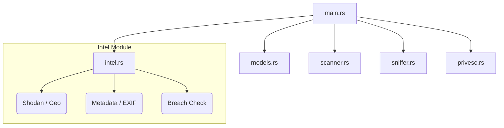

<p align="center">
  
</p>

<p align="center">
  
  
  
  
</p>

---

# 🛡️ NetVanguard v1.0.1
### *Hybrid Intelligence & Attack Surface Analyzer*

**NetVanguard**, modern siber güvenlik ihtiyaçları için geliştirilmiş, yüksek performanslı bir **Hibrit İstihbarat ve Saldırı Yüzeyi Analizörüdür**. Sadece bir ağ tarayıcısı değil, aynı zamanda pasif istihbarat (OSINT), aktif trafik analizi (Sniffing) ve yetki yükseltme (PrivEsc) vektörlerini tek bir çatı altında toplayan endüstriyel bir güvenlik paketidir.

---

## 🚀 Ana Modüller ve Kabiliyetler

### 1. 🔍 Gelişmiş Ağ Tarama (Nmap Engine)
NetVanguard, Nmap'in gücünü modern bir arayüzle birleştirir.
- **Hız Seçenekleri (Timing):** Gizlilik odaklı `T0` (Paranoid) modundan, agresif `T5` (Insane) moduna kadar tam kontrol.
- **Servis & Versiyon Tespiti:** Açık portların arkasındaki servislerin gerçek sürümlerini tespit eder.
- **İşletim Sistemi Analizi:** Hedef cihazın OS parmak izini çıkarır.
- **Vulnerability (Zafiyet) Taraması:** Nmap Scripting Engine (NSE) kullanarak bilinen açıkları otomatik tarar.

### 2. 🌐 Global Intelligence (OSINT & Geo)
Hedefi sadece IP olarak değil, bir kimlik olarak analiz eder.
- **Shodan Entegrasyonu:** Hedef IP'nin internet üzerindeki geçmişi, açık portları ve bilinen zaafları (CVE).
- **Coğrafi Konum:** IP tabanlı konum tespiti (Şehir, ISP, ASN bilgileri).
- **DNS & TLS Analizi:** Pasif DNS sorguları ve HTTPS sertifikalarından SNI ayrıştırma.

### 3. 📂 Metadata & Sızıntı Analizi (Advanced Intel)
- **Metadata (EXIF) Analizörü:** Görsel ve döküman dosyalarındaki gizli meta verileri (GPS, cihaz bilgisi, yazılım sürümü) milisaniyeler içinde ortaya çıkarır.
- **Sızıntı Tespiti (Breach Detection):** *XposedOrNot* API entegrasyonu ile e-posta adreslerinin geçmiş veri sızıntılarında yer alıp almadığını kontrol eder.

### 4. ⚔️ #L10 Yetki Yükseltme Analizörü (PrivEsc)
Sistem sızma sonrası aşamalar için özel olarak tasarlanmıştır.
- **SUID/GUID Kontrolü:** Yanlış yapılandırılmış kritik sistem dosyalarını tespit eder.
- **Kernel Exploit Suggester:** İşletim sistemi çekirdek sürümüne göre potansiyel exploitleri raporlar.
- **Capability Analizi:** Linux yeteneklerini (capabilities) tarayarak yetki yükseltme yollarını bulur.

### 5. 📡 Network Radar & Sniffer
- **Real-Time Sniffer:** L2/L3 seviyesinde paket yakalama ve TLS SNI üzerinden alan adı tespiti.
- **Wi-Fi Radar:** Çevredeki tüm kablosuz ağları ve sinyal güçlerini haritalandırır.

---

## 📸 Demo

*Not: Demo GIF placeholder'ıdır.*

---

## 🏛️ Mimari Yapı (Modular Refactor)



---

## 🛠️ Kurulum (Installation)

```bash
# Kurulum ve Hazırlık
chmod +x setup.sh
./setup.sh

# Çalıştırma
sudo cargo run
```

---

## ⚖️ Yasal Uyarı (Legal Disclaimer)

> [!CAUTION]
> NetVanguard, yalnızca **eğitim** ve **etik sızma testi** amaçlıdır. Yetkisiz kullanım yasal sorumluluk doğurur.

---

<p align="center">
  Developed with ❤️ by <b>Baha Furkan Yıldız</b> | v1.0.1
</p>
