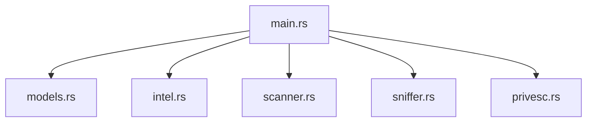

<p align="center">
  <a href="#-türkçe-versiyon">
    
  </a>
  <a href="#-english-version">
    
  </a>
</p>

# 🛡️ NetVanguard v1.0.1
### *Hybrid Intelligence & Attack Surface Analyzer*

<p align="center">
  
  
  
  
</p>

---

<div id="turkish-version"></div>

## 🇹🇷 Türkçe Versiyon

**NetVanguard**, modern siber güvenlik ihtiyaçları için geliştirilmiş, yüksek performanslı bir **Hibrit İstihbarat ve Saldırı Yüzeyi Analizörüdür**. Gelişmiş Nmap motoru, gerçek zamanlı Sniffer ve OSINT yeteneklerini tek bir çatı altında toplar.

### ⚡ Akıllı Kurulum (Smart Setup)
Kali Linux üzerinde hiçbir bağımlılıkla uğraşmadan, Docker veya Yerel (Local) kurulumu otomatik yapan akıllı sistemi başlatmak için:

```bash
git clone https://github.com/bfurkanyildiz/NetVanguard.git && cd NetVanguard
chmod +x setup.sh && sudo ./setup.sh
```

> [!TIP]
> **Hangi Yöntem Seçilmeli?**
> - **Docker (Önerilen):** Bağımlılık sorunu yaşamazsınız, sisteminiz kirlenmez. Sniffer ve Nmap tam yetkiyle çalışır.
> - **Yerel (Native):** Eğer sisteminizde Docker yoksa, script otomatik olarak Rust ve kütüphaneleri kurup projeyi derler.

### 🐳 Docker ile Manuel Başlatma
Eğer sadece Docker kullanmak isterseniz:
```bash
docker-compose up --build -d
```
*Panel Adresi: `http://localhost:8080`*

### 🛠️ Sistem Gereksinimleri (Manuel Kurulum İçin)
Eğer `setup.sh` kullanmadan kurmak isterseniz:
- **Paketler:** `pkg-config`, `libssl-dev`, `libpcap-dev`, `nmap`.
- **Dil:** Rust (Stable).
- **Yetki:** Sniffer için `cap_net_raw,cap_net_admin` yetkileri gereklidir (`run.sh` bunu otomatik halleder).

---

<div id="english-version"></div>

## 🇺🇸 English Version

**NetVanguard** is an industrial-grade **Hybrid Intelligence and Attack Surface Analyzer**. It combines advanced Nmap orchestration, real-time network sniffing, and OSINT capabilities into a unified, high-performance dashboard.

### ⚡ Smart Deployment
To launch the automated setup on Kali Linux (detects Docker and manages all dependencies automatically):

```bash
git clone https://github.com/bfurkanyildiz/NetVanguard.git && cd NetVanguard
chmod +x setup.sh && sudo ./setup.sh
```

> [!IMPORTANT]
> **The Smart Setup Logic:**
> 1. **Docker Mode:** If Docker is found, it installs/starts the containerized environment instantly.
> 2. **Local Fallback:** If Docker is missing, it installs Rust, Nmap, and required libraries to compile NetVanguard locally.

### 🐳 Manual Docker Run
If you prefer manual container management:
```bash
docker-compose up --build -d
```
*Web Panel: `http://localhost:8080`*

### 📸 Demo


### 🏛️ Architecture


### ⚖️ Legal Disclaimer
> [!CAUTION]
> NetVanguard is intended for **educational** and **ethical penetration testing** purposes only. Unauthorized use is strictly prohibited.

---

<p align="center">
  Developed with ❤️ by <b>Baha Furkan Yıldız</b> | v1.0.1
</p>
