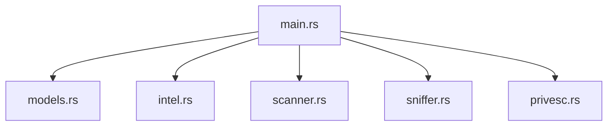

<p align="center">
  <a href="#-türkçe-versiyon">
    
  </a>
  <a href="#-english-version">
    
  </a>
  <a href="#setup-link">
    
  </a>
</p>

# 🛡️ NetVanguard v1.0.1
### *Hybrid Intelligence & Attack Surface Analyzer*

<p align="center">
  
  
  
  
</p>

---

<div id="turkish-version"></div>

## 🇹🇷 Türkçe Versiyon

**NetVanguard**, modern siber güvenlik ihtiyaçları için geliştirilmiş, yüksek performanslı bir **Hibrit İstihbarat ve Saldırı Yüzeyi Analizörüdür**. Sadece bir ağ tarayıcısı değil, aynı zamanda pasif istihbarat (OSINT), aktif trafik analizi (Sniffing) ve yetki yükseltme (PrivEsc) vektörlerini tek bir çatı altında toplayan endüstriyel bir güvenlik paketidir.

### 🚀 Ana Modüller ve Kabiliyetler

#### 1. 🔍 Gelişmiş Ağ Tarama (Nmap Engine)
- **Hız Seçenekleri (Timing):** Gizlilik odaklı `T0` modundan, agresif `T5` moduna kadar tam kontrol.
- **Vulnerability Taraması:** NSE kullanarak bilinen açıkları otomatik tarar.

#### 2. 🌐 Global Intelligence (OSINT & Geo)
- **Shodan Entegrasyonu:** Hedef IP'nin internet geçmişi ve bilinen zaafları (CVE).
- **DNS & TLS Analizi:** Pasif DNS sorguları ve HTTPS sertifikalarından SNI ayrıştırma.

#### 3. 📂 Metadata & Sızıntı Analizi
- **Metadata (EXIF) Analizörü:** Görsel ve dökümanlardaki gizli meta verileri ortaya çıkarır.
- **Sızıntı Tespiti:** *XposedOrNot* API ile e-posta sızıntı kontrolü.

#### 4. ⚔️ Yetki Yükseltme Analizörü (PrivEsc)
- **SUID/GUID Kontrolü:** Yanlış yapılandırılmış kritik sistem dosyalarını tespit eder.
- **Kernel Exploit Suggester:** Çekirdek sürümüne göre potansiyel exploitleri raporlar.

<div id="setup-link"></div>

### ⚡ Akıllı Kurulum (Smart Setup)
Kali Linux üzerinde projeyi tek komutla kurmak ve başlatmak için (Docker veya Yerel otomatik seçilir):
```bash
git clone https://github.com/bfurkanyildiz/NetVanguard.git && cd NetVanguard
chmod +x setup.sh && sudo ./setup.sh
```

### ⛵ Hızlı Başlatma (Quick Start)
Eğer sistemi daha önce kurduysanız:
1. **En Kolay Yol:** `./setup.sh` komutunu tekrar çalıştırın. Script sistemde her şeyin kurulu olduğunu anlayıp uygulamayı otomatik başlatacaktır.
2. **Manuel Başlatma (Yerel):** `sudo ./target/release/netvanguard`
3. **Docker Kullanıcıları:** `docker compose up`
4. **DASHBOARD ERİŞİMİ:** **http://localhost:8080**

### 📸 Demo


### 🏛️ Mimari Yapı


### ⚖️ Yasal Uyarı
> [!CAUTION]
> NetVanguard, yalnızca **eğitim** ve **etik sızma testi** amaçlıdır.

---

<div id="english-version"></div>

## 🇺🇸 English Version

**NetVanguard** is an industrial-grade **Hybrid Intelligence and Attack Surface Analyzer** engineered for modern cybersecurity requirements. It consolidate passive intelligence (OSINT), active traffic analysis (Sniffing), and privilege escalation (PrivEsc) vectors into a single unified platform.

### 🚀 Core Modules & Capabilities

#### 1. 🔍 Advanced Network Scanning (Nmap Engine)
- **Timing Profiles:** Full control from stealthy `T0` (Paranoid) to aggressive `T5` (Insane) modes.
- **Vulnerability Scanning:** Automatically audits known exposures using the Nmap Scripting Engine (NSE).

#### 2. 🌐 Global Intelligence (OSINT & Geo)
- **Shodan Integration:** Access target IP history, open ports, and documented vulnerabilities (CVEs).
- **DNS & TLS Analysis:** Passive DNS resolution and SNI extraction from HTTPS certificates.

#### 3. 📂 Metadata & Breach Analysis
- **Metadata (EXIF) Analyzer:** Instantly extracts hidden metadata (GPS, device info, software) from images and documents.
- **Breach Detection:** *XposedOrNot* API integration to check if email addresses have been compromised in historical data leaks.

#### 4. ⚔️ Privilege Escalation Analyzer (PrivEsc)
- **SUID/GUID Audit:** Identifies misconfigured critical system files and permissions.
- **Kernel Exploit Suggester:** Reports potential exploits optimized for the system's specific kernel version.

### ⚡ Rapid Deployment (One-Liner)
Run the following command on a Kali Linux machine to clone, setup, and launch (Automated Docker/Local detection):
```bash
git clone https://github.com/bfurkanyildiz/NetVanguard.git && cd NetVanguard
chmod +x setup.sh && sudo ./setup.sh
```

### ⛵ Quick Start
If you have already installed the system:
1. **Simplest Way:** Run `./setup.sh`. It will detect existing components and launch the hub automatically.
2. **Manual Launch (Local):** `sudo ./target/release/netvanguard`
3. **Docker Users:** `docker compose up`
4. **DASHBOARD ACCESS:** **http://localhost:8080**

### 🏛️ Architecture


### ⚖️ Legal Disclaimer
> [!CAUTION]
> NetVanguard is intended for **educational** purposes only.

---

<p align="center">
  Developed with ❤️ by <b>Baha Furkan Yıldız</b> | v1.0.1
</p>
